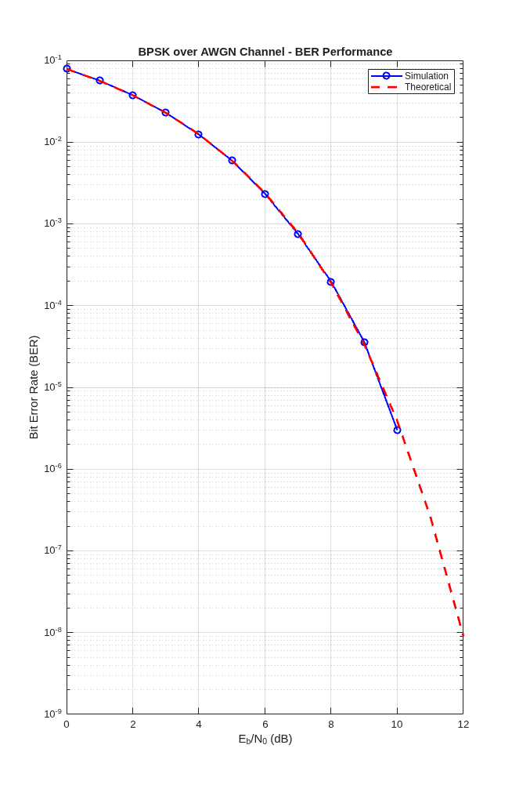

# محاكاة أداء نظام التعديل الرقمي BPSK عبر قناة AWGN باستخدام MATLAB

## 1. مقدمة عن المشروع
يقدم هذا المشروع محاكاة برمجية هندسية متكاملة لتقييم أداء نظام التعديل الرقمي **BPSK (Binary Phase Shift Keying)** عند إرسال البيانات عبر قناة ذات ضوضاء بيضاء مضافة **AWGN (Additive White Gaussian Noise)**. يقوم المشروع بحساب معدل خطأ البت التجريبي (Simulated BER) ومقارنته بالمنحنى النظري القياسي (Theoretical BER) للتحقق من كفاءة النظام اللاسلكي.

## 2. النموذج الرياضي وقناة الإرسال (Mathematical Model)
تعتمد المحاكاة على توليد نبضات عشوائية يتم تعديلها طورياً (BPSK Mapping)، حيث يتم تمثيل البتات كالتالي:
* البت $1 \rightarrow +1$
* البت $0 \rightarrow -1$

تتعرض الإشارة اللاسلكية عبر القناة لضوضاء عشوائية محكومة بالمعادلة الرياضية التالية:
$$Y = X + N$$

حيث أن $N$ تمثل الضوضاء وتتبع التوزيع الطبيعي بنصف قطر طاقة يعتمد على نسبة الإشارة إلى الضوضاء الكلية ($SNR$). ولتجنب مشاكل التوافقية، تم حساب الأداء النظري هندسياً باستخدام دالة الخطأ المتممة ($erfc$):
$$BER_{theory} = \frac{1}{2} \text{erfc}(\sqrt{\text{SNR}})$$

## 3. منحنى أداء النظام (BER Performance Curve)
يوضح الرسم البياني الناتج عن تنفيذ الكود التطابق الدقيق والكامل بين المحاكاة العملية والمنحنى النظري القياسي:

## 4. كيفية التشغيل والتنفيذ
1. قم بتحميل ملف الكود `BPSK_AWGN__Simulation.m`.
2. افتح الملف داخل بيئة **MATLAB** (أو تطبيق MATLAB للهواتف).
3. اضغط **Run** لتنفيذ المحاكاة وحفظ منحنى الأداء تلقائياً كصورة عالية الجودة.
4. 
